# 📊 Elasticsearch & Kibana RBAC Project (IEC 62443-Inspired)

This project demonstrates a realistic, secure Elastic Stack deployment on WSL2 with **Role-Based Access Control (RBAC)** inspired by the **IEC 62443 standard** for industrial environments.  
It covers creating least-privilege user accounts, verifying with CLI and UI, and logging exactly what each role can — and *can’t* — do.

---

## 📌 Table of Contents

1. ✅ Overview  
2. 🔑 Superuser Login & Admin Checks  
3. 🛡️ RBAC Roles & Privileges  
   - Logstash Writer Role
   - Monitor Role
   - SOC Analyst Role
4. 👥 User Accounts  
   - Logstash Writer User
   - Monitor User
   - SOC Analyst User
5. 🔍 Tests & Validation
   - CLI Tests
   - UI Access Tests
   - Discover Queries
6. 📸 Screenshots by Section

---

## ✅ 1. Overview

- Deployed **Elasticsearch**, **Kibana**, and **Logstash** on **WSL2**  
- Enabled HTTPS and built-in user authentication
- Created custom roles:
  - `levi_logstash_writer_role` → pipeline writes only
  - `levi_monitor_role` → read-only cluster monitoring
  - `levi_analyst_role` → SOC-style access to dashboards & Discover
- Enforced **least privilege** with real CLI and UI tests

---

## 🔑 2. Superuser Login & Admin Checks

### Login as `elastic` Superuser

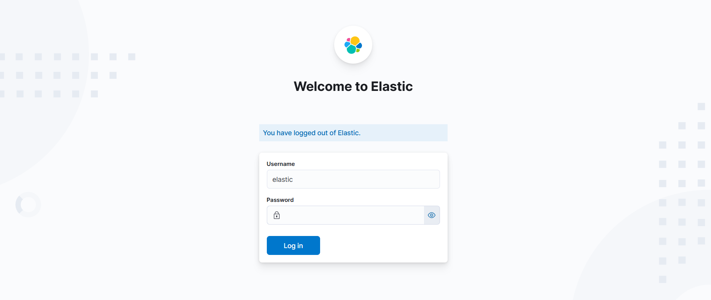  
_Elastic Stack login screen using the built-in `elastic` superuser._

### Admin Welcome Page

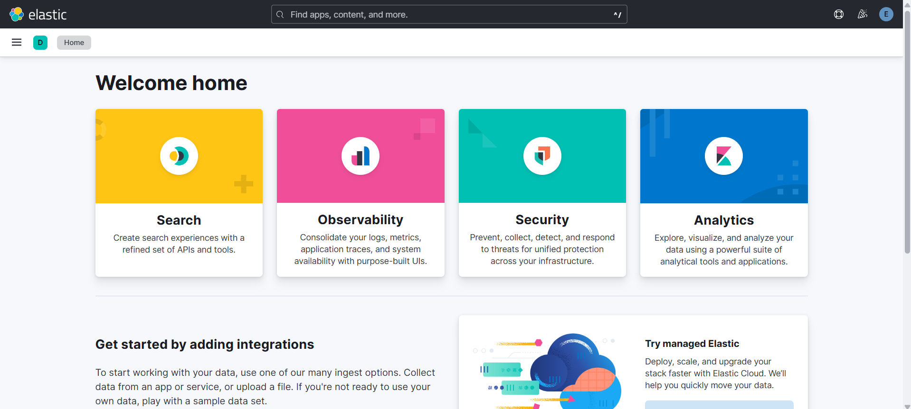  
_Successful login shows full-stack admin access._

### Admin RBAC View

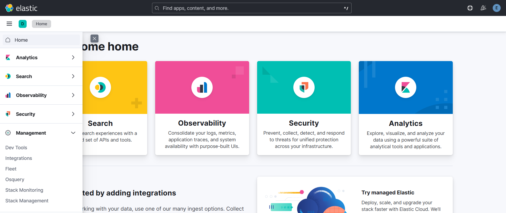  
_Admin console showing all custom roles created._

### Discover as Admin

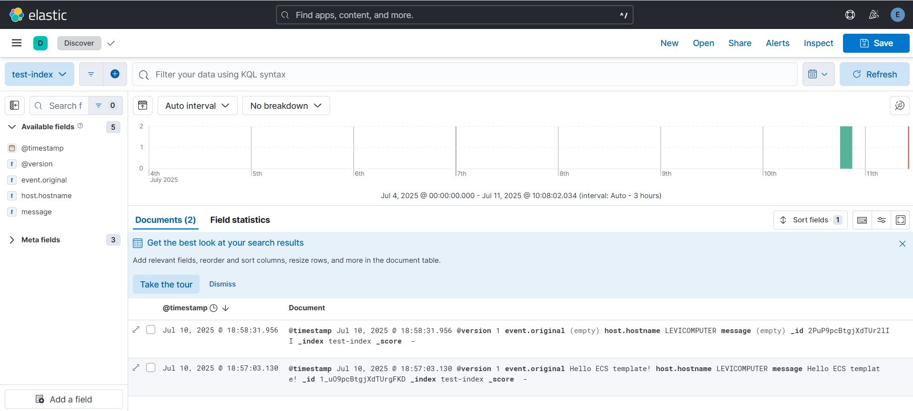  
_Verifying index data and Discover view as the superuser._

---

## 🛡️ 3. RBAC Roles & Privileges

### Logstash Writer Role

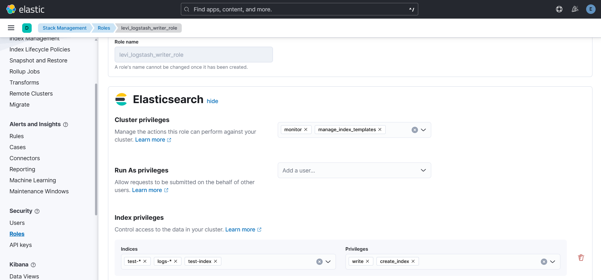  
_Custom `levi_logstash_writer_role` with write-only permissions for pipelines._

### Monitor Role

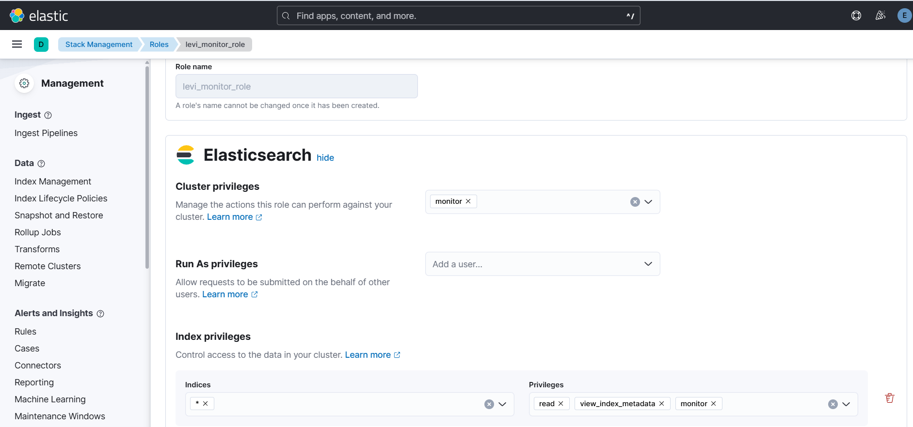  
_Custom `levi_monitor_role` for read-only cluster and index stats._

### SOC Analyst Role

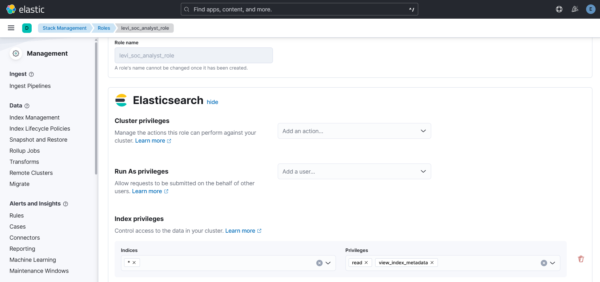  
_Custom `levi_analyst_role` for SOC users to access dashboards._

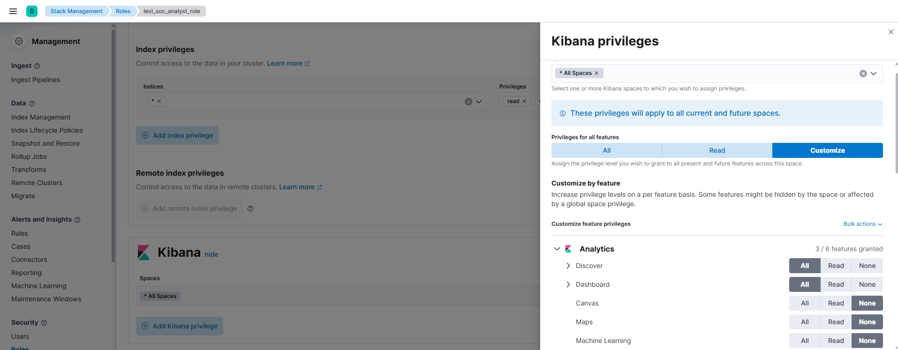  
_Kibana feature-level privileges scoped for `levi_analyst_role`._

---

## 👥 4. User Accounts

### Logstash Writer User

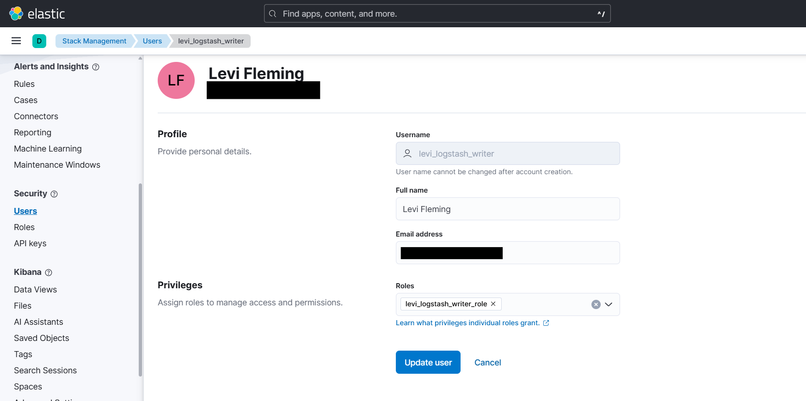  
_User `levi_logstash_writer` mapped to the writer role for pipeline outputs only._

### Monitor User

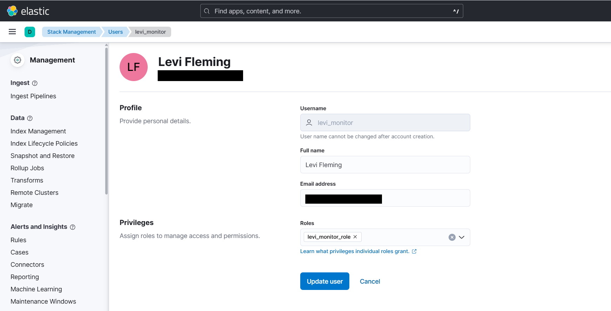  
_User `levi_monitor` mapped to the monitor role._

### SOC Analyst User

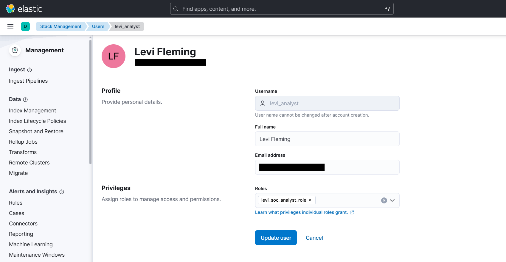  
_User `levi_analyst` mapped to the SOC analyst role._

### Analyst Welcome Page

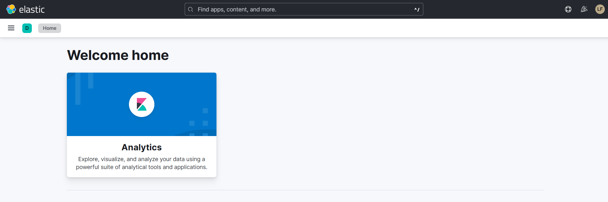  
_Analyst login shows appropriate access._

### Analyst Login Attempt

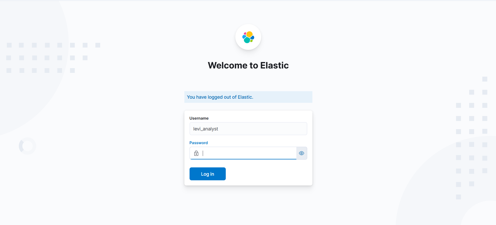  
_Login view for the analyst role._

### Analyst Correct Role Confirmation

  
_Validates correct role assignment._

### Analyst RBAC Details

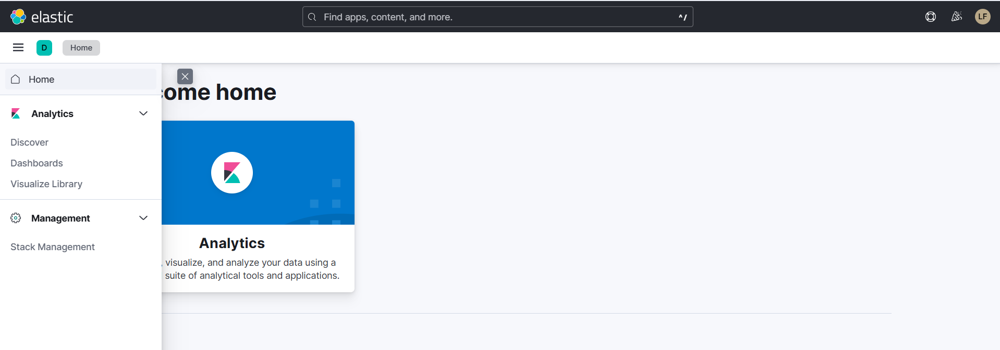  
_RBAC screen confirming granular privileges._

---

## 🔍 5. Tests & Validation

### 🟢 Logstash Writer CLI Test (Expected 403)

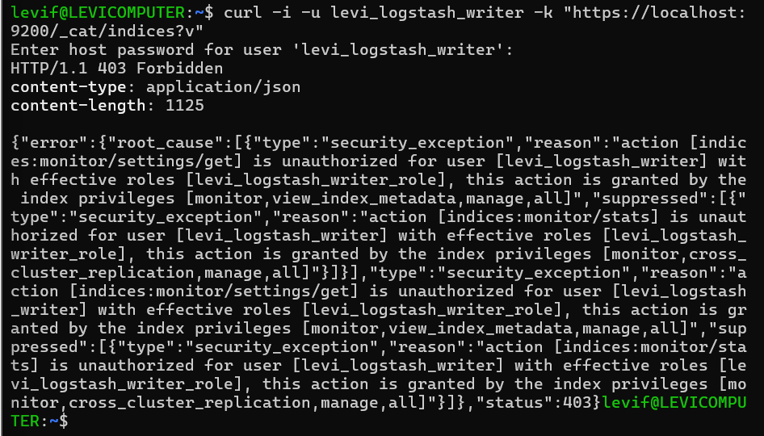  
_Test shows `levi_logstash_writer` gets **403 Forbidden** for read queries — pipeline-only as intended._

### 🔴 Logstash Writer UI Login Attempt

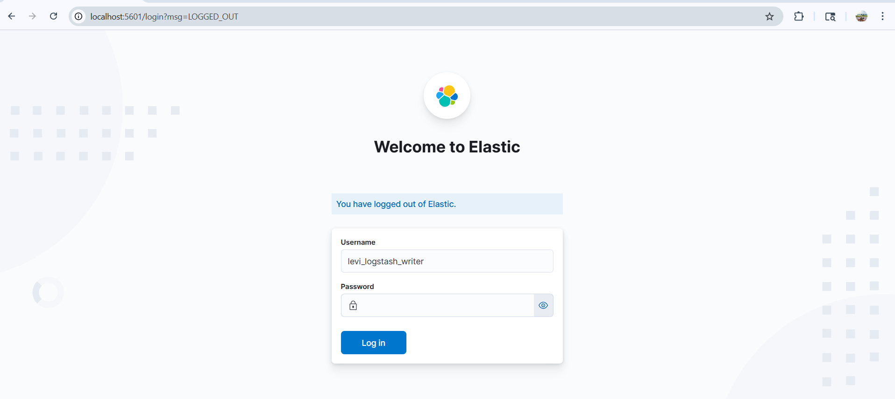  
_Attempt to log in to Kibana as `levi_logstash_writer` is blocked._

### 🚫 Logstash Writer No Permission Page

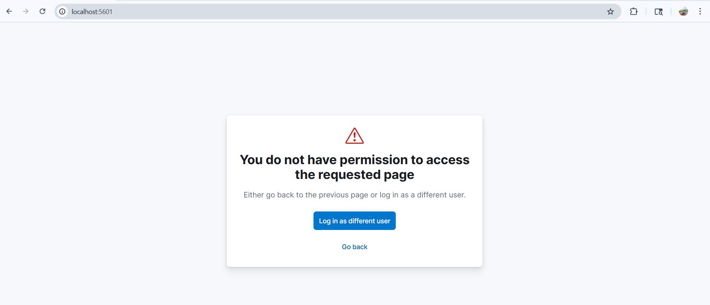  
_Permission denied page proves zero UI access for pipeline-only users._

---

### 🟢 Monitor CLI Test

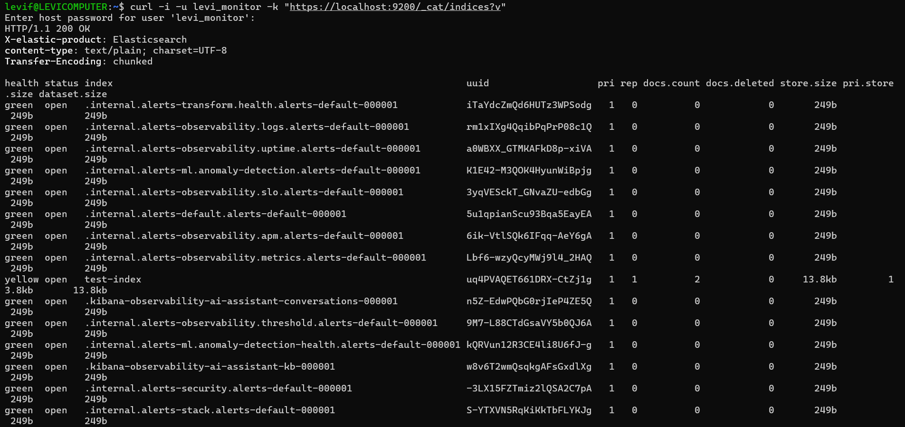  
_CLI query returns healthy indices for `levi_monitor`._

### 🗂️ Monitor Role Details

  
_Monitor role definition for context._

### 🗂️ Monitor User Details

  
_Monitor user mapping confirmation._

---

### ✅ SOC Analyst Discover Test

  
_Analyst using Discover to query allowed indices._

---

## 📸 6. Screenshots by Section

All screenshots live in `/images/` for easy reference.

---

## 🗒️ How to Run

```bash
sudo systemctl start elasticsearch kibana logstash
